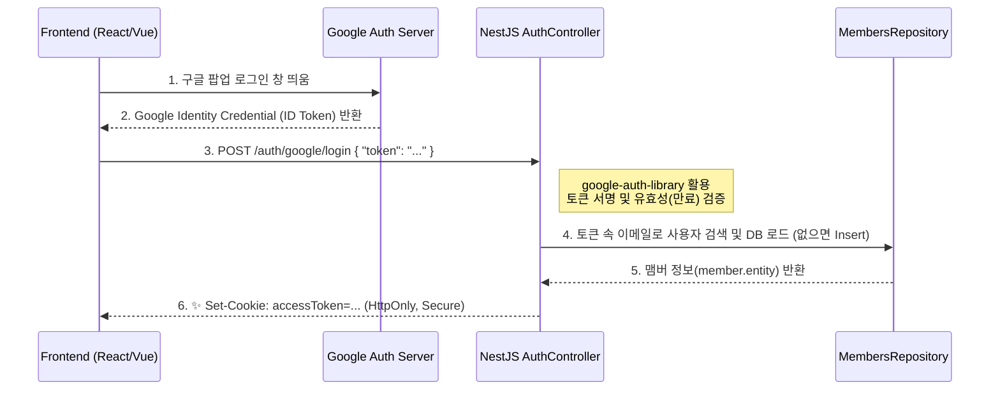

# 사용자 인증 및 세션 아키텍처 가이드 (SSO & JWT)

본 문서는 `mesapphub` 모노레포 프로젝트에서 채택한 **Google OAuth 로그인(사내 AD SSO 역할 대체)**과 **사용자 세션 유지 방식(K8s 친화적 아키텍처)**에 대한 설계 규칙을 정의합니다.

---

## 1. 아키텍처 개요 (Stateless + HttpOnly Cookie)

쿠버네티스(k8s) 오케스트레이션 환경처럼 백엔드 컨테이너가 수시로 증설(Scale-Out)되거나 로드밸런싱이 일어나는 분산 환경에서는, 특정 서버 메모리에 유저 상태를 저장하는 '세션(Session)' 방식 대신 철저하게 **무상태(Stateless)**를 유지하는 것이 아키텍처 설계의 원칙입니다.

따라서 본 프로젝트는 **Google SSO 토큰 검증**을 통해 사용자 신원을 확보한 뒤, 자체 **JWT(Json Web Token)** 엑세스 토큰을 발행하여 컨테이너 확장성을 보장합니다. 탈취 공격(XSS) 방어를 위해 이 토큰은 프론트엔드가 직접 제어할 수 없는 **HTTP-Only Cookie**에 강제로 주입됩니다.

---

## 2. 로그인 파이프라인 (Google Identity Services)

프론트엔드와 백엔드의 강한 결합(서버사이드 리다이렉션)을 피하고, 프론트엔드 주도적인 비동기 처리를 달성하기 위해 최신 스펙인 `Token Verification` 방식을 사용합니다.

---

## 3. 핵심 설계 포인트 및 방어 메커니즘

### 1) 왜 OAuth 리다이렉트가 아닌 토큰 전달 방식인가요?
기존의 서버에 콜백 URL을 연결하고 리다이렉트 시키는 방식은 백엔드에서 화면 분기를 처리해야 하므로 SPA(마이크로 프론트엔드, React) 환경에 적합하지 않습니다. 프론트엔드가 순수하게 구글 토큰을 따와서 API를 호출하는 이 구조는, 추후 **사내 자체 AD SSO**나 카카오/네이버 등 연동 수단이 추가되더라도 백엔드 로직 수정이 극도로 적다는 장점이 있습니다.

### 2) 왜 세션(Session)이 아닌 JWT 인가요?
서버에 상태를 저장하는 세션을 K8s에서 유지하려면 모든 파드(Pod)가 공유하는 외부 메모리 DB(Redis 등)가 필수적이거나, Ingress에서 Sticky Session(한 가지 컨테이너만 보도록 고정)을 박아두어야 합니다. 이는 시스템 병목으로 직결됩니다.
반면 JWT는 토큰 자체에 전자서명이 되어 있어, **100개의 컨테이너 중 어떤 것에 API 요청이 떨어지더라도 즉각적으로 유저를 식별**할 수 있습니다.

### 3) 왜 로컬 스토리지에 JWT를 보관하지 않나요?
프론트엔드 자바스크립트로 접근 가능한 `localStorage`나 변수에 토큰을 방치하면, 해커가 악성 스크립트 한 단락만 주입해도(XSS 공격) 토큰이 광범위하게 탈취됩니다. 백엔드가 발행 시점부터 브라우저의 전용 보안 구역인 `HttpOnly Cookie`에 심어주면 자바스크립트는 구조적으로 토큰을 열람할 수 없어 강력한 보안 체계가 구성됩니다.

---

## 4. 프론트엔드 통신 가이드라인
로그인이 성공한 시점부터 백엔드가 브라우저에 인증 쿠키를 심어버리므로, 프론트엔드에서 API 요청을 보낼 때 토큰 값을 찾아 헤더에 박아 넣는 행위(`Authorization: Bearer ...`)는 더 이상 **필요하지 않습니다.**

다만, 이후 통신부터 브라우저가 자동으로 쿠키를 동봉하여 보낼 수 있도록 `Axios`나 `Fetch` 클라이언트에 반드시 **`withCredentials: true`** 옵션을 전역으로 설정하여 모든 요청을 전송해야 합니다.
